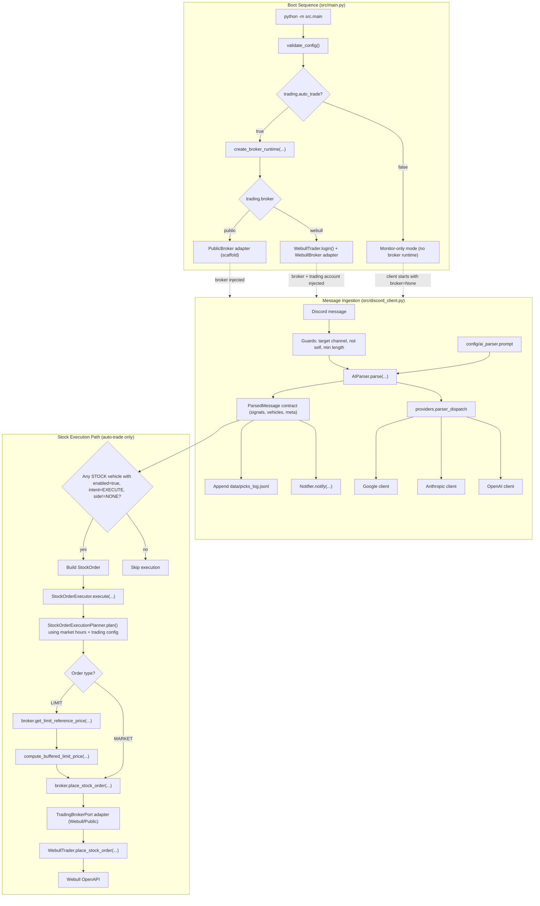

# Discord Stock Monitor

Monitors one Discord channel, extracts trade signals with AI, notifies/logs signals, and can optionally place stock orders through the configured broker.

## Mission

Make Discord trade alerts operational with a clear, testable flow:
Discord message -> structured signal -> optional trade execution.

## What The App Does

1. Watches a configured Discord channel.
2. Sends each relevant message to your configured AI provider.
3. Normalizes AI output into a strict parser contract.
4. Sends notifications and appends logs.
5. Optionally places stock orders when `trading.auto_trade=true` (Webull execution path implemented).

## System Design (Runtime Architecture)



## Runtime Flow

1. `python -m src.main` starts the app and validates config.
2. If auto-trade is enabled, `create_broker_runtime(...)` resolves broker runtime (`webull`/`public`).
3. `StockMonitorClient` receives Discord messages.
4. Guard checks run (target channel, not self message, minimum content).
5. `AIParser.parse(...)` builds prompt context and calls provider (`openai`/`anthropic`/`google`).
6. AI output is normalized to `ParsedMessage`/`ParsedSignal` and validated by the parser contract.
7. Signals are notified/logged, then only executable STOCK vehicles are mapped into `StockOrder`.
8. `StockOrderExecutor` applies planner rules (market session + config) and routes to broker adapter.

## Core Components

| Component | Responsibility | File |
|---|---|---|
| Entrypoint | Bootstraps config, broker runtime, and client | `src/main.py` |
| Broker runtime factory | Selects broker and builds runtime (`webull`/`public`) | `src/brokerages/factory.py` |
| Discord client | Message handling, parser orchestration, and execution routing | `src/discord_client.py` |
| AI parser | Prompt rendering, provider dispatch, output normalization | `src/ai_parser.py` |
| Parser contract models | Canonical parser output (`ParsedMessage`, `ParsedSignal`, `ParsedVehicle`) | `src/models/parser_models.py` |
| Order planner | Chooses market vs limit behavior from session/config | `src/trading/orders/planner.py` |
| Order executor | Builds executable order and calls broker port | `src/trading/orders/executor.py` |
| Broker interface | Execution + market-data contract for adapters | `src/brokerages/ports.py` |
| Webull adapter | Maps broker-port calls to `WebullTrader` | `src/brokerages/webull/broker.py` |
| Webull SDK wrapper | Webull OpenAPI auth, quotes, and order placement | `src/webull_trader.py` |
| Config loader | Env + YAML/JSON config resolution | `config/settings.py` |

## Parser -> Trader Contract

`StockMonitorClient` maps parser output to stock execution using these fields:

| Parser field | Used for |
|---|---|
| `ticker` | Target symbol |
| `vehicles[].type` | Only `STOCK` vehicles are execution candidates |
| `vehicles[].enabled` | Must be `true` to execute |
| `vehicles[].intent` | Must be `EXECUTE` to execute |
| `vehicles[].side` | `BUY`/`SELL` mapped to `StockOrder.side`; `NONE` skipped |
| `weight_percent` | Optional sizing hint to trader |
| `meta.*` | Observability and debug context |

Execution note:

- `action` is part of parser semantics but runtime stock execution gates on `vehicles[*]` plus `ticker`.
- Other AI fields may exist but do not currently change stock order routing.

## AI Prompt Template (Rules + Variables)

Prompt template source: `config/ai_parser.prompt`.

Runtime variables currently injected by `AIParser`:

- Always: `CURRENT_TIME`, `AUTHOR_NAME`, `MESSAGE_TEXT`, `ANALYST_NAME`, `ANALYST_PREFERENCES`, `ACCOUNT_CONSTRAINTS`.
- When trader/account context exists: `ACCOUNT_BALANCE`, `MARGIN_POWER`, `CASH_POWER`, `MARGIN_EQUITY_PERCENTAGE`.
- Current gaps: placeholders like full live `OPTIONS_CHAIN` are not fully populated yet.

Core parsing rules from the template:

- Extract only clear action picks (`Added`, `Buying`, `Trimming`, `Exiting`, `Selling`).
- Ignore commentary/watchlist text with no explicit action.
- Apply the options-intent rule: intent language for calls/puts counts as actionable options BUY intent.
- Return structured JSON matching the parser contract (`contract_version`, `source`, `signals`, `meta`).

Contract boundary note:

- `AIParser` normalizes provider output through `ParsedMessage`/`ParsedSignal`/`ParsedVehicle`.
- Trading path currently routes executable STOCK vehicles (`type/enabled/intent/side`) plus optional `weight_percent`.
- Extra AI keys outside model contract are ignored for execution.

## Current Behavior Limits

- `MIN_CONFIDENCE` is configured but not currently enforced as a hard pre-trade gate.
- Auto-trading path places stock orders; option-specific execution is not wired yet.
- Some advanced prompt placeholders (like live options chain) are not fully populated yet.

## Quick Start

- Python 3.11.x is required (3.11.14 pinned via `.python-version`).

```bash
python scripts/bootstrap/project_setup.py
source .venv/bin/activate
python -m src.main
```

## Configuration Files

- Secrets: `.env`
- Main app settings: `config/trading.yaml`
- AI prompt template: `config/ai_parser.prompt`

## Testing And Confidence

Detailed confidence policy and suite organization live in:

- `tests/README.md`

Main commands:

```bash
pytest
pytest -m smoke
python -m scripts.quality.run_health_checks
python -m scripts.quality.run_confidence_suite
```

## Extensibility

- AI provider strategy is pluggable through `AI_PROVIDER` and parser/provider init logic.
- Brokerage integration can be extended by adding trader adapters alongside `src/webull_trader.py`.

## Agent Workflow Files

The repository includes agent-focused assets to standardize planning, execution, and review:

- `AGENTS.md`: rules and guardrails for agent-driven changes.
- `docs/conventions.md`: repository development conventions.
- `docs/testing.md` and `docs/test-standards.md`: testing policy and expectations.
- `docs/manual-testing.md`: 10-minute manual happy-path verification.
- `docs/runbook.md`: operational runbook/checklist for task execution.
- `docs/ai-memory.md`: durable implementation notes and decisions.
- `docs/system-context/`: deeper system context for architecture, contracts, and operations.
- `prompts/`: reusable prompt templates for coding and automation work.
- `mcp/`: MCP setup references and example server configuration.
